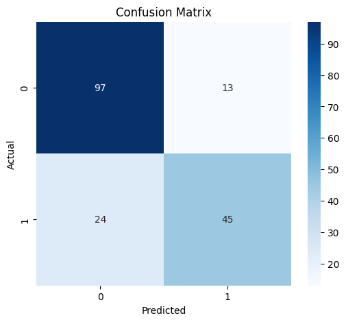
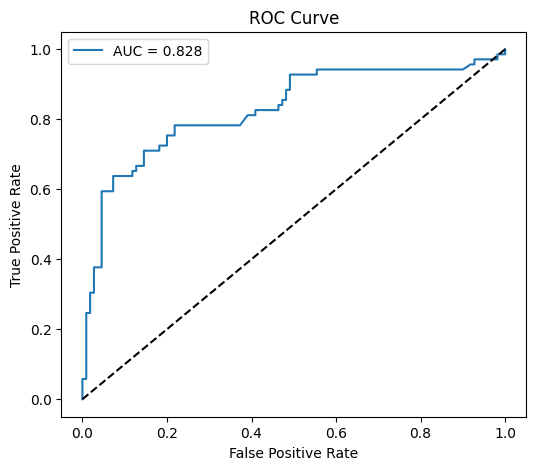
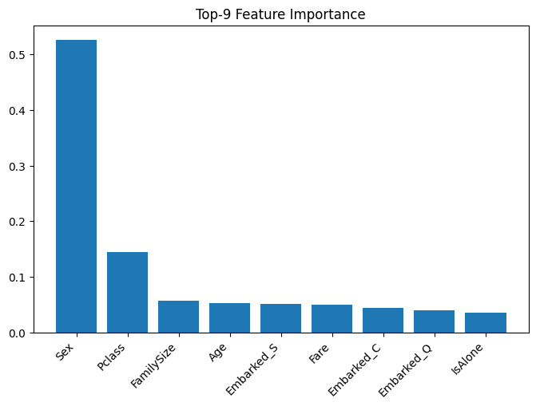

# Titanic ML Pipeline

[](https://github.com/andreevqt/titanic-ml-pipeline/actions/workflows/ci.yml)

## Требования

Задача — предсказать выживаемость пассажиров Титаника (бинарная классификация: `Survived = 1` или `0`).

**Ключевой вопрос:** по каким признакам можно определить, выжил ли пассажир?

**Цель:** автоматизировать весь ML-пайплайн — от загрузки данных до мониторинга модели — и упаковать его в воспроизводимый Docker-контейнер с CI/CD.

## Схема пайплайна

```
data/raw/Titanic-Dataset.csv
         │
         ▼
  ┌─────────────┐
  │    ETL      │  очистка, признаки, разбивка
  └──────┬──────┘
         │ data/processed/
         ▼
  ┌─────────────┐
  │  AutoML     │  FLAML: подбор модели + гиперпараметры
  │  (FLAML)    │──► MLflow (метрики, параметры, модель)
  └──────┬──────┘
         ├──► reports/ (confusion matrix, ROC, feature importance)
         ▼
  ┌─────────────┐
  │  Monitoring │  Evidently: дрейф данных → drift_report.html
  └─────────────┘
```

## ETL (Extract, Transform, Load)

| Шаг | Логика |
|-----|--------|
| Extract | Загрузка `data/raw/Titanic-Dataset.csv` |
| Удаление столбцов | `Name`, `Ticket`, `PassengerId`, `Cabin` (>77% пропусков) |
| Заполнение `Age` | Медиана по группам `Pclass` + `Sex` |
| Заполнение `Embarked` | Мода (`S`) |
| Feature engineering | `FamilySize = SibSp + Parch + 1`, `IsAlone` |
| Кодирование | Label-encoding `Sex`, one-hot `Embarked` |
| Нормализация | StandardScaler на обучающей выборке: `Age`, `Fare`, `FamilySize` |
| Load | `data/processed/titanic_clean.csv`, `train.csv`, `test.csv` |

## Архитектура ML-модели

**AutoML:** FLAML автоматически перебирает модели и гиперпараметры:
- LightGBM, XGBoost, Random Forest, Logistic Regression

**Лучшая модель:** XGBClassifier

**Автоматизированные элементы пайплайна:**
- Выбор семейства модели
- Поиск гиперпараметров (time-budgeted)
- Кросс-валидационная оценка с ранней остановкой

## Метрики модели

| Метрика | Значение |
|---------|---------|
| ROC-AUC | 0.8198 |
| Accuracy | 0.8156 |
| F1-score | 0.7442 |

## Визуализации

### Confusion Matrix


### ROC Curve


### Feature Importance


## AutoML (FLAML)

FLAML (Microsoft) — лёгкая библиотека AutoML с фиксированным временным бюджетом.

- `time_budget=60` сек — поиск лучшей конфигурации за 1 минуту
- `metric="roc_auc"` — оптимизируемая метрика
- Все запуски логируются в MLflow: параметры, метрики, артефакт модели

**Файл:** `.github/workflows/ci.yml`

При каждом PR в `main`: запускаются тесты (`pytest tests/ -v`).
При merge в `main`: собирается и пушится Docker-образ в GHCR.

**Образ:** `ghcr.io/andreevqt/titanic-ml-pipeline:latest`
## Мониторинг

### Качество модели (MLflow)

MLflow логирует для каждого запуска:
- Параметры: `best_estimator`, `time_budget`, гиперпараметры
- Метрики: `val_roc_auc`, `val_accuracy`, `val_f1`, `cpu_percent`, `memory_mb`
- Артефакт: обученная модель

### Дрейф данных (Evidently)

`reports/drift_report.html` — отчёт о дрейфе признаков и качестве данных (train vs test).

### Инфраструктура (psutil + Docker)

- `cpu_percent` и `memory_mb` — логируются в MLflow во время обучения
- Мониторинг ресурсов контейнера: `docker stats`

## Тесты

```bash
pytest tests/ -v
# 9 тестов: ETL (6) + обучение (2) + end-to-end (1)
```

## Запуск проекта

```bash
# Клонировать и запустить локально
git clone https://github.com/andreevqt/titanic-ml-pipeline.git
cd titanic-ml-pipeline
pip install -r requirements.txt
python -m src.pipeline

# Или через Docker
docker build -t titanic-pipeline .
docker run --rm -v $(pwd)/reports:/app/reports -v $(pwd)/mlruns:/app/mlruns titanic-pipeline
```
